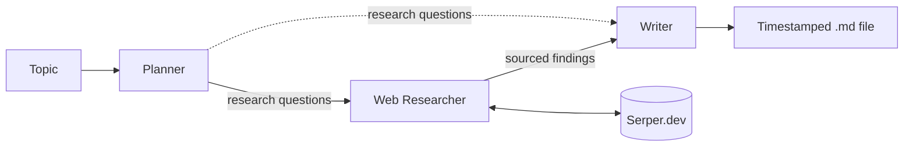

# Research Crew

A three-agent CrewAI pipeline that turns a topic into a sourced markdown research report.

Give it a topic. A **Planner** agent generates focused research questions, a
**Web Researcher** agent searches the web via Serper.dev and gathers answers with source
URLs, and a **Writer** agent synthesizes those findings into a structured markdown report
with inline citations. Reports are written to a timestamped file in.

```bash
python -m research_crew.crew "the economic impact of remote work"
```

Four reports generated by this pipeline are in [`examples/`](examples/).

## How it works

Three agents run in sequence. Each task receives the previous task's output as context.

| Agent | Role | Tools | Constraints |
|-------|------|-------|-------------|
| **Planner** | Decomposes the topic into 3–5 focused research questions | none | — |
| **Web Researcher** | Answers each question with sourced findings, prioritizing authoritative sources | Serper.dev web search | `max_iter=25` |
| **Writer** | Synthesizes findings into a structured markdown report with inline citations | none | — |



The Writer receives both the research questions and the findings, so report sections map
one-to-one onto the original questions. All three agents share a single `LLM` object,
which keeps the model and token settings in one place and lets the output file's metadata
header report the model name directly from that object rather than a hardcoded string.

Only the Web Researcher touches an external service, which is why the iteration cap sits
on that agent specifically — see [Engineering notes](#engineering-notes).

## Example output

Four reports in [`examples/`](examples/), each generated by a single command and committed
unedited apart from the filename:

| Report | Topic |
|--------|-------|
| [`report_remote-work-economic-impact.md`](examples/report_remote-work-economic-impact.md) | Economic impact of remote work |
| [`report_middle-school-music-engagement.md`](examples/report_middle-school-music-engagement.md) | Student engagement in middle school general music |
| [`report_ai-school-impact.md`](examples/report_ai-school-impact.md) | AI's impact on primary and secondary schools |
| [`report_fastest-growing-careers.md`](examples/report_fastest-growing-careers.md) | Fastest-growing career paths |

Each report opens with a metadata header recording the topic, generation timestamp, and
model, so a sample file is self-describing without the README open alongside it.

### Source quality

Both the Web Researcher's goal and its task instruction direct it to prioritize primary and
authoritative sources — government data, peer-reviewed research, established research
institutions — and to note explicitly when a finding rests on a weaker source.

Across all four topics, the agent flagged weaker sources inline rather than presenting them
at the same confidence as stronger ones. From the remote work report:

> A lower-confidence, survey-based study by **Great Place to Work** (800,000+ employees)
> found "stable or improved productivity" after remote transitions — useful corroborating
> evidence, but weighted below the government and academic sources above.

The four reports are the evidence for this. I have not run a
controlled comparison against an unprompted baseline, so this is an observed behavior across
four runs.

## Engineering notes

I built this to get hands-on with multi-agent orchestration and to see how far
prompt-level constraints can push output quality. Two failures during development shaped
the code more than the original design did. Both are written up in detail, including what
I could and couldn't verify:

- **[Silent truncation](docs/debugging/01-silent-truncation.md)** — the `LLM` object had
  no `max_tokens` set. The Writer's long cited reports stopped mid-sentence with no
  exception and no warning. Fixed by setting it explicitly and adding a check that warns
  when output doesn't end in sentence punctuation.

- **[Runaway tool calls](docs/debugging/02-runaway-tool-calls.md)** — the Web Researcher
  had no stopping condition and burned 100+ Serper calls on a single topic. Fixed with
  `max_iter=25` plus backstory guidance to move on after 2–3 solid sources per question.

The pattern in both: the failure was silent or unbounded, and the fix was as much about
making the constraint explicit as about the constraint itself.

## Limitations and what I'd improve

**No evaluation layer -** The source-quality behavior described above is something I
observed across four runs, not something I measured. There's no automated way to tell
whether a prompt change improved or degraded output. A
scoring pass over generated reports (source-type distribution, citation density, presence
of hedging language on weak sources) would turn that from a judgment call into a metric.

**No tests -** The helper functions (`slugify`, `build_output_path`,
`build_metadata_header`) are pure and trivially testable, and aren't tested.

**No retry or error handling -** A single failed API call ends the run and discards
everything produced up to that point — which is exactly what happened during the
[runaway tool calls](docs/debugging/02-runaway-tool-calls.md) incident. Retries with
backoff, and persisting each task's output as it completes, would make a long run
recoverable instead of all-or-nothing.

**Cost is bounded loosely -** `max_iter=25` caps search iterations, but nothing caps token
spend. There's no per-run cost estimate and no ceiling.

**No caching -** Running the same topic twice pays full price twice.

**Fixed pipeline -** The three-agent sequence is hardcoded; every topic gets the same
treatment regardless of whether it warrants three research questions or eight, and there's
no branching, retry-on-poor-results, or conditional depth.

## Quick start

**Requirements:** Python 3.13.14, an [Anthropic API key](https://console.anthropic.com/), and a
[Serper.dev API key](https://serper.dev/).

```bash
git clone https://github.com/jballard9909/research-crew.git
cd research-crew
python -m venv .venv && source .venv/bin/activate   # Windows: .venv\Scripts\activate
pip install -r requirements.txt

cp .env.example .env        # add ANTHROPIC_API_KEY and SERPER_API_KEY
python -m research_crew.crew "your topic here"
```

The report prints to the terminal and is saved as
`outputs/report_{topic-slug}_{timestamp}.md`. For my project, `outputs/` is gitignored. The
reports in `examples/` are a limited selection of all reports generated.

Note: Each run makes live calls to both APIs and consumes credits on both.
